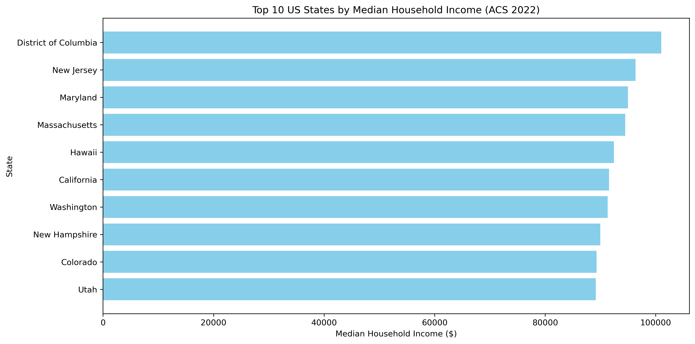

 ### Overview

This project uses the **US Census API** (ACS 1-Year Estimates) to identify the **Top 10 US States by Median Household Income**. It demonstrates how to work with APIs, clean and analyze data with **pandas**, and visualize insights with **matplotlib** in Python. This script fetches data from the US Census Bureau API, specifically the median household income by state for the year 2022. It processes the data using pandas and visualizes the top 10 states by median household income using a horizontal bar chart. This small project is useful for market research and product launch strategies.

### Sample Output

**Console Output:**
```
                    NAME  B19013_001E
8   District of Columbia       101027
30            New Jersey        96346
20              Maryland        94991
21         Massachusetts        94488
11                Hawaii        92458
4             California        91551
47            Washington        91306
29         New Hampshire        89992
5               Colorado        89302
44                  Utah        89168
```

**Visualization:**



*Bar chart showing the top 10 US states/territories by median household income based on 2022 ACS data*


